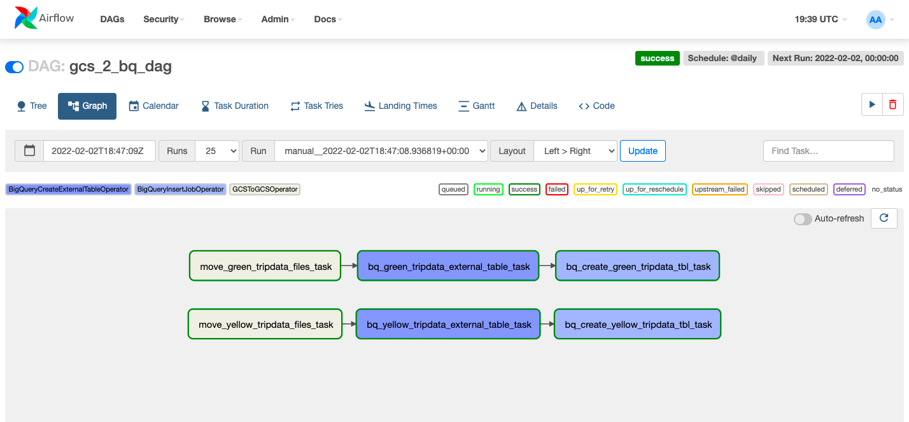
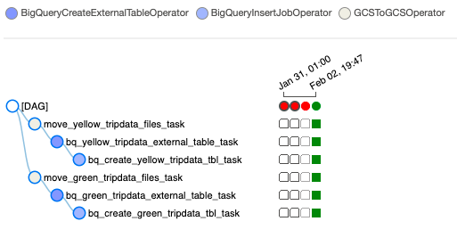

# Airflow Concepts and Architecture

[Airflow Concepts and Architecture](../week_2_data_ingestion/airflow/docs/1_concepts.md)

## Workflow





## Setup - Official Version

(For the section on the Custom/Lightweight setup, scroll down)

[Airflow Setup with Docker, through official guidelines](1_setup_official.md)

### Execution

- Build the image (only first-time, or when there's any change in the `Dockerfile`, takes ~15 mins for the first-time):

  ```shell
  docker-compose build
  ```

  or (for legacy versions)

  ```shell
  docker build .
  ```

- Initialize the Airflow scheduler, DB, and other config

  ```shell
  docker-compose up airflow-init
  ```

- Kick up the all the services from the container:

  ```shell
  docker-compose up
  ```

- In another terminal, run `docker-compose ps` to see which containers are up & running (there should be 7, matching with the services in your docker-compose file).
- Login to Airflow web UI on `localhost:8080` with default creds: `airflow/airflow`
- Run your DAG on the Web Console.
- On finishing your run or to shut down the container/s:

    ```shell
    docker-compose down
    ```

    To stop and delete containers, delete volumes with database data, and download images, run:

    ```shell
    docker-compose down --volumes --rmi all
    ```

    or

    ```shell
    docker-compose down --volumes --remove-orphans
    ```

## Setup - Custom No-Frills Version (Lightweight)

This is a quick, simple & less memory-intensive setup of Airflow that works on a LocalExecutor.

[Airflow Setup with Docker, customized](2_setup_nofrills.md)

### Execution
  
- Stop and delete containers, delete volumes with database data, & downloaded images (from the previous setup):

    ```shell
    docker-compose down --volumes --rmi all
    ```

   or
  
    ```shell
    docker-compose down --volumes --remove-orphans
    ```

   Or, if you need to clear your system of any pre-cached Docker issues:

    ```shell
    docker system prune
    ```

   Also, empty the airflow `logs` directory.

- Build the image (only first-time, or when there's any change in the `Dockerfile`):
  Takes ~5-10 mins for the first-time

    ```shell
    docker-compose build
    ```

    or (for legacy versions)

    ```shell
    docker build .
    ```

- Kick up the all the services from the container (no need to specially initialize):

    ```shell
    docker-compose -f docker-compose-nofrills.yml up
    ```

- In another terminal, run `docker ps` to see which containers are up & running (there should be 3, matching with the services in your docker-compose file).
- Login to Airflow web UI on `localhost:8080` with creds: `admin/admin` (explicit creation of admin user was required)
- Run your DAG on the Web Console.
- On finishing your run or to shut down the container/s:

    ```shell
    docker-compose down
    ```

## Future Enhancements

- Deploy self-hosted Airflow setup on Kubernetes cluster, or use a Managed Airflow (Cloud Composer) service by GCP

## References

For more info, check out these official docs:

- <https://airflow.apache.org/docs/apache-airflow/stable/start/docker.html>
- <https://airflow.apache.org/docs/docker-stack/build.html>
- <https://airflow.apache.org/docs/docker-stack/recipes.html>
