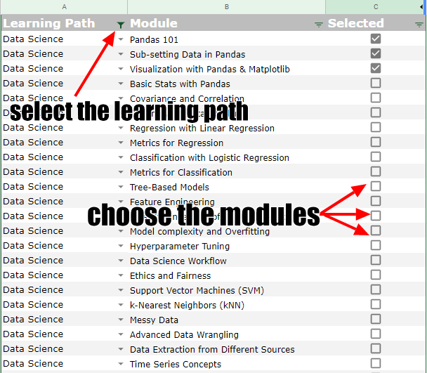
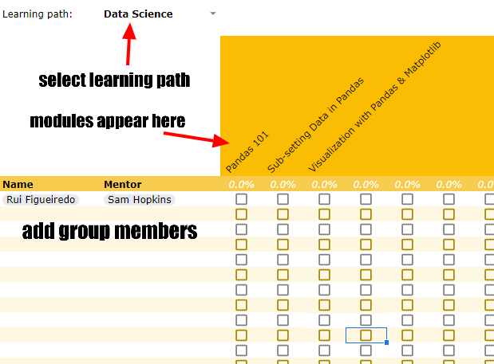

# Data Engineering Learning Path

Welcome to the Data Engineering Learning Path! 🤖👍

This course was adapted from the [DataTalksClub's Data Engineering Zoomcamp](https://github.com/DataTalksClub/data-engineering-zoomcamp) to the NOS ecosystem.

- You can join DataTalks at [DataTalks.Club](https://datatalks.club).
- The videos are published on [DataTalks.Club's YouTube channel](https://www.youtube.com/c/DataTalksClub) in [the course playlist](https://www.youtube.com/playlist?list=PL3MmuxUbc_hJed7dXYoJw8DoCuVHhGEQb)
- Their [FAQs](https://docs.google.com/document/d/19bnYs80DwuUimHM65UV3sylsCn2j1vziPOwzBwQrebw/edit?usp=sharing) page is already filled with answers for many technical questions you might have.

This course was designed to give you a foundation in data engineering. After finishing it you should also feel comfortable using tools like Docker, Terraform, and Google Cloud Platform. The data engineering topics that will be covered are:

- Data ingestion
- Data Warehouse
- Data orchestration with Airflow
- Data transformations with dbt
- Batch processing with PySpark
- Stream processing with Kafka

In this introduction, you'll learn:

- The directions driving your learning experience in this course.
- The structure of the course.
- The expectations on students and mentors.
- A suggested learning calendar.

## Learning Principles

When we assembled this course, we had in mind that our students would be adult individuals with time constraints. They will be looking to implement the knowledge in their work environment and maybe discuss it with their peers.

To fulfill these expectations, we adopted the following principles:

- Prefer self-directed learning over teacher-directed learning;
- Prefer content that's easily accessible (no paywalls or subscriptions);
- Prefer content that can be immediately applied;
- Always use code examples;
- Learning by teaching is encouraged.

## Learning Structure

Students are to be divided into groups of 3. These groups should try to progress through the learning process together so that their questions and discussion are on the same wavelength. Each group will be assigned a mentor. A mentor is a more experienced collaborator and/or someone who has already gone through the course. They are in charge of helping their group, answering questions and preventing them from being stuck, as well as keeping track of their progress.

### Suggested learning calendar

> **Note**: This is just a suggestion. Groups are encouraged to set their own deadlines with their mentors.

- [Week 1: Introduction & Prerequisites](week_1_basics_n_setup)
  - Course overview
  - Introduction to GCP
  - Docker and docker-compose
  - Running Postgres locally with Docker
  - Setting up infrastructure on GCP with Terraform
  - Preparing the environment for the course

> **Note:** NYC TLC changed the format of the data we use to parquet. But you can still access
> the csv files [here](https://github.com/DataTalksClub/nyc-tlc-data).

- [Week 2: Data ingestion](week_2_data_ingestion)
  - Data Lake
  - Workflow orchestration
  - Setting up Airflow locally
  - Ingesting data to GCP with Airflow
  - Ingesting data to local Postgres with Airflow
  - Moving data from AWS to GCP (Transfer service)
- [Week 3: Data Warehouse](week_3_data_warehouse)
  - Data Warehouse
  - BigQuery
  - Partitioning and clustering
  - BigQuery best practices
  - Internals of BigQuery
  - Integrating BigQuery with Airflow
  - BigQuery Machine Learning
- [Week 4: Analytics engineering](week_4_analytics_engineering/)
  - Basics of analytics engineering
  - dbt (data build tool)
  - BigQuery and dbt
  - Postgres and dbt
  - dbt models
  - Testing and documenting
  - Deployment to the cloud and locally
  - Visualizing the data with Google Data Studio and Metabase
- [Week 5: Batch processing](week_5_batch_processing)
  - Batch processing
  - What is Spark
  - Spark Dataframes
  - Spark SQL
  - Internals: GroupBy and joins
- [Week 6: Streaming](week_6_stream_processing)
  - Introduction to Kafka
  - Schemas (avro)
  - Kafka Streams
  - Kafka Connect and KSQL
- [Week 7- 9: Project](week_7_project)
  - Week 7 and 8: working on your project
  - Week 9: reviewing your peers

### Progress and Questions Tracking

In order to help mentors in tracking the progress of their groups, we suggest using the following template:

- [Progress  Question Tracking template](https://docs.google.com/spreadsheets/d/1nODnLBLCcC6Dqe_pK_bog-BA78E9AuUq1l4S81Px61w/edit?usp=sharing)

#### Setup

Each group should have its own copy of the template.

The mentor should select which courses will be part of the learning path inside the "Courses" tab:

  

This will add the courses to the learning path tracker.

  

#### Tracking questions

Tracking questions is important so that we can improve the quality of the selected material, as well as create new ones.

We understand that some chapters might be really close, and students might want to ask questions directly to the mentor, to also have the question available publicly is to everybody's advantage.

### Learning Unit Workflow

Each learning unit a `README.md` file with instructions and, with the exception of [Week 1: Introduction & Prerequisites](week_1_basics_n_setup), a `homework.md` file with the homework instructions. For each homework there's also a solution video. Modules are to be run inside Docker containers, so ensure you have it installed.

At the end of the learning path, there will be a final project. The project will be peer-reviewed by another member of your group.

The learning units follow video lessons and you can find the lesson's code inside the `code` folder.

## Expectations

### Expectations for students

Although we understand that time may be constrained, each student has responsibilities within their group, namely:

- Try to keep pace with the group's progress, neither falling too behind nor advancing too much by themselves.
- Be open in your discussions with the group, so that everyone can understand the material.
- Be courteous and respectful  to your peers and mentor.
- Set your progress expectations with your mentor.
- Conduct yourself with integrity and honesty.

### Expectations for mentors

A mentor are tasked in ensuring their peers become better professionals, as such, we expect them to:

- Reserve at least 30 minutes per week for each group you mentor, for answering questions and giving feedback.
- Encourage group members and communicate openly.
- Be courteous and respectful to your mentees.
- Keep track of questions and progress of the group members (see [Progress tracking](#progress-and-questions-tracking))
- Conduct yourself with integrity and honesty.

## Pre-requisites

In order to make the best use of this learning path, you should know:

- Basic Python
- Basic SQL
- Comfortable with SQL

Prior experience with data engineering is not required.

## DataTalks Instructors

- Ankush Khanna (<https://linkedin.com/in/ankushkhanna2>)
- Sejal Vaidya (<https://linkedin.com/in/vaidyasejal>)
- Victoria Perez Mola (<https://www.linkedin.com/in/victoriaperezmola/>)
- Alexey Grigorev (<https://linkedin.com/in/agrigorev>)

## Tools

For this learning path, you'll need to have the following software installed on your computer:

- Docker and Docker-Compose
- Python 3
- Google Cloud SDK
- Terraform

Are you ready to get started? If so, go over to the `dataset.md` section to read more about the data you'll be using throughout the learning path.
